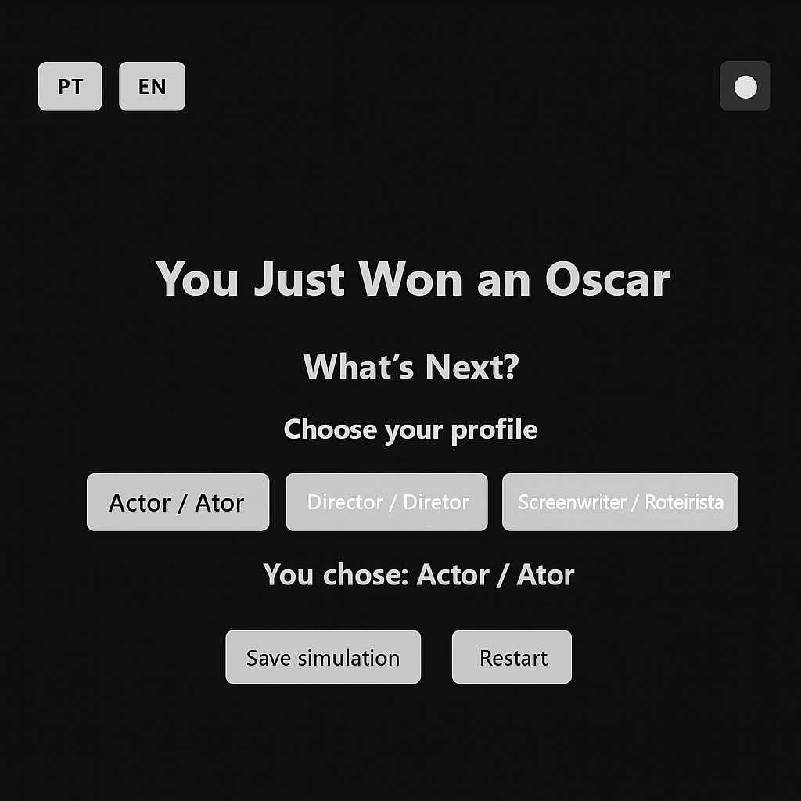

# 🏆 Oscar Simulator

Imagine que você acabou de ganhar um Oscar...
E agora?

Explore diferentes trajetórias pós-premiação, tome decisões, veja as consequências e descubra seu perfil na indústria cinematográfica.

🌐 [Acesse o simulador](https://oscar-simulator.vercel.app)

---

## 📸 Preview



---

## ✨ Funcionalidades

- Internacionalização dinâmica (PT / EN)
- Tela inicial visual com entrada animada
- Trilha de decisões em 3 etapas
- Cálculo de reputação (prestígio / lucro / relevância)
- Resultado final personalizado
- Salvamento no Firebase (modo leve)
- Modo escuro / claro com memória de preferência

---

## 🚀 Como rodar localmente

```bash
git clone https://github.com/seu-usuario/oscar-simulator.git
cd oscar-simulator
npm install (caso use Vite/React futuramente)
Live Server no index.html (ou use extensão no VS Code)
```

---

## 🔐 Como configurar o Firebase

1. Acesse [Firebase Console](https://console.firebase.google.com)
2. Crie um novo projeto
3. Habilite Firestore Database
4. No código `firebase.js`, cole suas credenciais:

```js
const firebaseConfig = {
  apiKey: "...",
  authDomain: "...",
  projectId: "...",
  ...
};
```

---

## 📌 Roadmap futuro

- Exportar resultado em PDF
- Autenticação com Google para salvar trajetórias
- Ranking público e compartilhamento
- Perfis jogáveis com histórico
- Desafios semanais (modo "Black Mirror")

---

## 🧠 Idealização

Criado por [@tedtheotheodoro](https://github.com/tedtheotheodoro) como experimento interativo sobre fama, cultura pop e escolhas criativas.

Inspiração visual: sites de storytelling minimalista + simuladores narrativos estilo RPG.

---

💬 Feedbacks e colaborações são bem-vindos!
